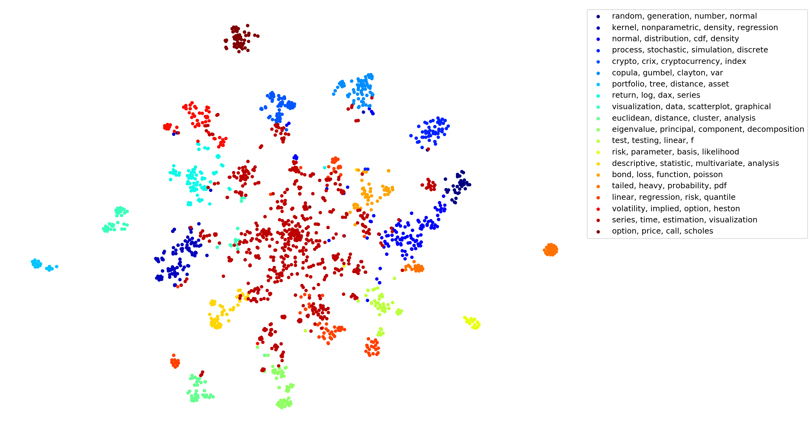

[](http://quantlet.de/)

## [](http://quantlet.de/) **Quantlet_Extraction_Evaluation_Visualisation** [](http://quantlet.de/)

```yaml

Name of QuantLet : Quantlet_Extraction_Evaluation_Visualisation

Published in : ''

Description : 'Extraction, grading and clustering of the Quantlets in the GitHub Organization Quantlet with the use of the classes modules/QUANTLET.py and modules/METAFILE.py. With this program you can extract, update and save the data, model topics with Latent Semantic Analysis, compute different clusterings and visualize the clustering with t-Stochastic Neighbour embedding.'

Keywords : Text analysis, LSA, t-SNE, clustering, kmeans clustering, spectral clustering, visualisation

See also : ''

Author : Marius Sterling

Submitted : September 18 2018 by Marius Sterling

Example : 
```



### PYTHON Code
```python
from modules.QUANTLET import QUANTLET
import os

filename = 'data_file_'
github_token = None
USER = 'Quantlet'
# Creates if necessary the folders in the list
for i in ['data']:
    if i not in os.listdir():
        os.mkdir(i)

# looks for already saved files, if there is none, loads all data and save them
f = sorted([i for i in os.listdir('data') if 'json' in i and filename in i])
if not f:
    q = QUANTLET(github_token=github_token, user=USER)
    q.download_metafiles_from_user()
    name = 'data/' + filename
    name += q.get_last_commit().strftime('%Y%m%d')
    name += '.json'
    q.save(name)
else:
    q = QUANTLET.load('data/' + f[-1])

# Update all existing metafiles in q
q.update_existing_metafiles()

# Update all existing metafiles and searches for new Quantlets
q.update_all_metafiles(since=q.last_full_check)

# Saving data newly
name = 'data/' + filename
name += q.get_last_commit().strftime('%Y%m%d')
name += '.json'
q.save(name)


# return bad graded quantlets
grades = q.grading()
grades.loc[grades['q_quali'].isin(['C','D','F'])]

# Extract corpus and dictionary, document term matrix dtm
c,d      = q.get_corpus_dictionary()
dtm      = q.get_document_term_matrix(corpus=c,dictionary=d)
c_tfidf  = q.get_corpus_tfidf(c,d)

# do tf-idf and extract document topic  matrix X
lsa      = q.lsa_model(corpus=c_tfidf, dictionary=d, num_topics=20)
X        = q.get_lsa_matrix(lsa, corpus=c_tfidf, dictionary=d)

# cluster the Quantlets with K-Means into groups
cl,_     = q.cl_kmeans(X=X, n_clusters=20)

# 
named_cl = q.topic_labels(cl=cl,document_topic_matrix=X, lsa=lsa, top_n=4)
q.tsne(X, named_cl, n_iter=2500, save_directory='',save_ending='kmeans', file_type='png')


```
